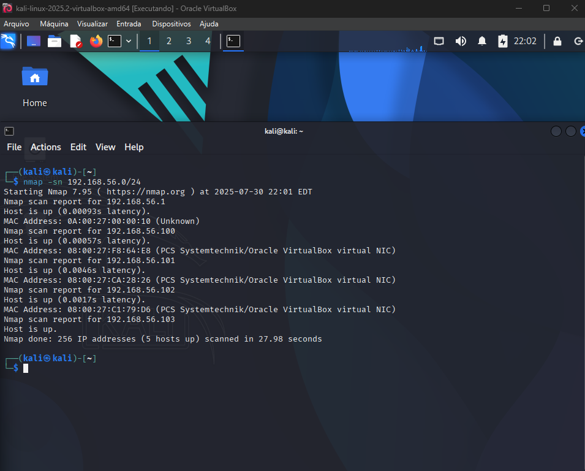
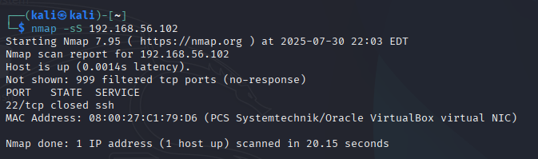

# Laboratório de Segurança com Kali Linux

> Projeto educacional para práticas de **reconhecimento de rede** e **enumeração de serviços** utilizando o Kali Linux como máquina atacante, em um ambiente virtualizado e isolado.

---

## Configuração do Ambiente

- **Ferramenta de virtualização:** Oracle VirtualBox  
- **Rede:** Interna isolada `192.168.56.0/24`

### Máquinas virtuais

| Máquina        | Função   | IP                |
|----------------|----------|-------------------|
| Kali Linux     | Atacante | Automático (DHCP) |
| Ubuntu Server  | Alvo     | 192.168.56.102    |
| Windows Server | Alvo     | 192.168.56.101    |

---

## Procedimentos Realizados

### Verificação de Conectividade

```bash
ping 192.168.56.101  # Windows Server
ping 192.168.56.102  # Ubuntu Server
```

---

### Varredura de Rede com Nmap

```bash
nmap -sn 192.168.56.0/24
```

**Resultados:**
- 192.168.56.1 (Gateway)
- 192.168.56.100
- 192.168.56.101 → Windows Server
- 192.168.56.102 → Ubuntu Server
- 192.168.56.103

---

### Enumeração de Portas e Serviços

#### Windows Server (192.168.56.101)

```bash
nmap -sS 192.168.56.101
nmap -sV 192.168.56.101
nmap -O 192.168.56.101
```

**Descobertas:**
- Porta **5985/tcp** aberta (Windows Remote Management)
- Serviço: `Microsoft HTTPAPI httpd 2.0`
- SO detectado: Windows Server 2022/2016 ou Windows 11

#### Ubuntu Server (192.168.56.102)

```bash
nmap -sS 192.168.56.102
nmap -sV 192.168.56.102
nmap -O 192.168.56.102
```

**Descobertas:**
- Porta **22/tcp (SSH)** fechada
- SO detectado: Linux (provavelmente 2.6.x)

---

## Conclusões e Aprendizados

1. **Isolamento de Ambiente**  
   Utilizar rede interna no VirtualBox é eficaz para testar sem riscos externos.

2. **Técnicas de Reconhecimento**
   - `ping` para testar conectividade
   - `nmap -sn` para descobrir hosts ativos
   - `nmap -sS`, `-sV`, `-O` para uma visão completa de cada alvo

3. **Diferenças entre Sistemas**
   - Windows expôs serviços administrativos
   - Ubuntu não tinha portas abertas

4. **Desafio**
   - Detecção de SO limitada com poucas portas abertas
---

## Considerações de Segurança

- Ambiente **100% isolado**, sem internet ou rede local
- Projeto feito **exclusivamente para fins educacionais**
- Nenhuma ação foi executada fora do ambiente de laboratório

---

## Imagens do Projeto

As imagens abaixo ilustram as etapas do laboratório:

| Varredura de Rede | Nmap no Windows | Nmap no Ubuntu |
|-------------------|------------------|----------------|
|  |  |  |

---

## Estrutura de Arquivos

[`arquivos/`](./arquivos/) → Comandos, resultados, logs  
[`imagens/`](./imagens/) → Prints das atividades

---

## Aviso Legal

Este projeto é **apenas para aprendizado** em segurança da informação.  
**Não utilize essas técnicas em redes ou sistemas sem permissão.**  
O autor **não se responsabiliza** por qualquer uso indevido deste material.
